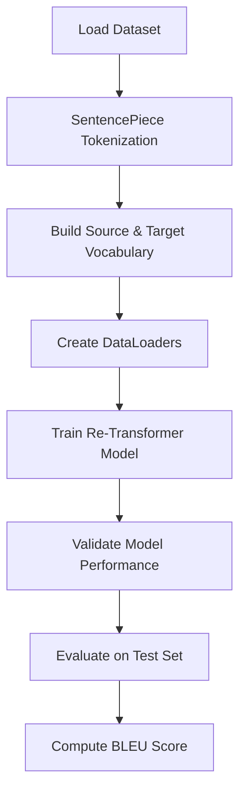
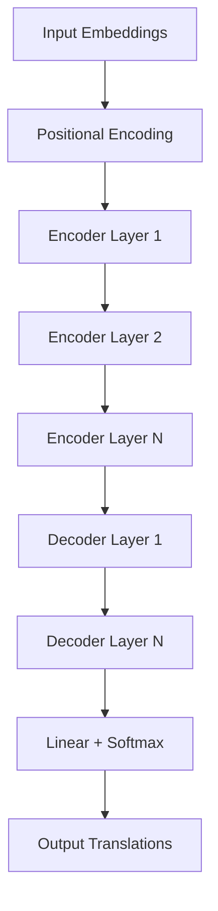

# Re-Transformer: A Self-Attention Based Model for Machine Translation

## Overview
The **Re-Transformer** is a machine translation model that improves upon the traditional Transformer architecture. It incorporates **Delayed Non-Linear Transformation** and **Dual Self-Attention Mechanisms** in the encoder layers to enhance translation quality. The project is implemented using **PyTorch** and includes extensive pre-processing, training, and evaluation pipelines.

---

## Table of Contents
1. [Project Structure](#project-structure)
2. [Pipeline Overview](#pipeline-overview)
3. [Re-Transformer Architecture](#re-transformer-architecture)
4. [Installation & Setup](#installation--setup)
5. [Usage](#usage)
6. [Model Training & Evaluation](#model-training--evaluation)
7. [Results & BLEU Score](#results--bleu-score)
8. [License](#license)

---

## Project Structure

```
.
├── __pycache__
├── create_src_model_vocab.py
├── create_tgt_model_vocab.py
├── dataset_divider.py
├── hyperparametertuner.py
├── main.py
├── retransformer.py
├── single_sentence_test.py
├── source_sentences.txt
├── src_only.model
├── src_only.vocab
├── target_sentences.txt
├── test.py
├── testing.csv
├── tgt_only.model
├── tgt_only.vocab
├── training.csv
├── validation.csv
└── README.md
```

---

## Pipeline Overview

Below is the **data processing and model training pipeline**:



### Explanation:
1. **Load Dataset**: Read source (`src`) and target (`tgt`) sentences from CSV files.
2. **Tokenization**: Use SentencePiece to tokenize the text.
3. **Build Vocabulary**: Construct vocabularies for both source and target sentences.
4. **DataLoaders**: Convert tokenized data into tensors and create DataLoaders.
5. **Training**: Train the Re-Transformer model using cross-entropy loss.
6. **Validation**: Evaluate loss on validation set.
7. **Testing**: Translate test sentences and compare with ground truth.
8. **BLEU Score Calculation**: Compute BLEU score for translation quality assessment.

---

## Re-Transformer Architecture



### Re-Transformer Features
1. **Positional Encoding**: Provides sequence information to the model.
2. **Dual Self-Attention Encoder**: Two self-attention layers per encoder block.
3. **Delayed Non-Linear Transformation**: Applied in alternate encoder layers.
4. **Masked Multi-Head Attention in Decoder**: Prevents seeing future tokens during training.
5. **Final Linear + Softmax Layer**: Converts logits into probabilities.

---

## Installation & Setup

### Prerequisites
- Python 3.8+
- PyTorch
- TorchText
- SentencePiece
- SacreBLEU

### Installation
```bash
pip install torch torchtext sacrebleu sentencepiece pandas
```

---

## Usage

### 1. Training the Model
```bash
python main.py
```

### 2. Testing Single Sentence Translation
```bash
python single_sentence_test.py
```

### 3. Running Hyperparameter Tuning
```bash
python main.py --hyperparametertuning
```

---

## Model Training & Evaluation

### Training Loop
1. Forward pass through **Re-Transformer**.
2. Compute **CrossEntropyLoss** (ignoring padding tokens).
3. Perform **gradient clipping** to prevent exploding gradients.
4. Use **Adam optimizer with OneCycleLR** scheduler.
5. Validate model on **validation set**.
6. Early stopping based on **patience criteria**.

### Model Evaluation
- Load **best saved model**.
- Translate test sentences.
- Compute **BLEU score** for translation quality.

---

## Results & BLEU Score

### Sample Predictions
| Target Translation | Predicted Translation |
|--------------------|----------------------|
| The cat is big.   | The cat is large.    |
| She loves reading. | She likes to read.  |

### BLEU Score
```
BLEU Score = 34.8
```

---

## License

```text
MIT License
```

